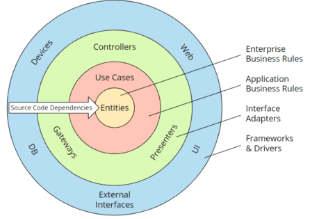
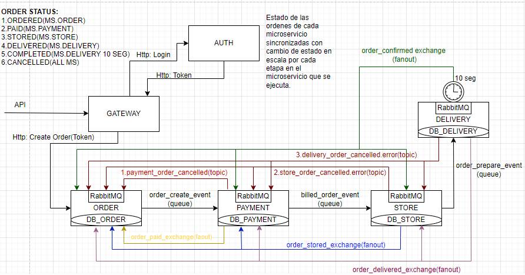
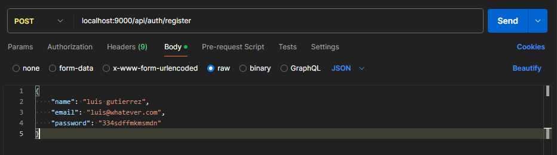
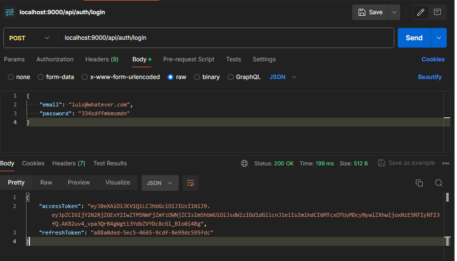
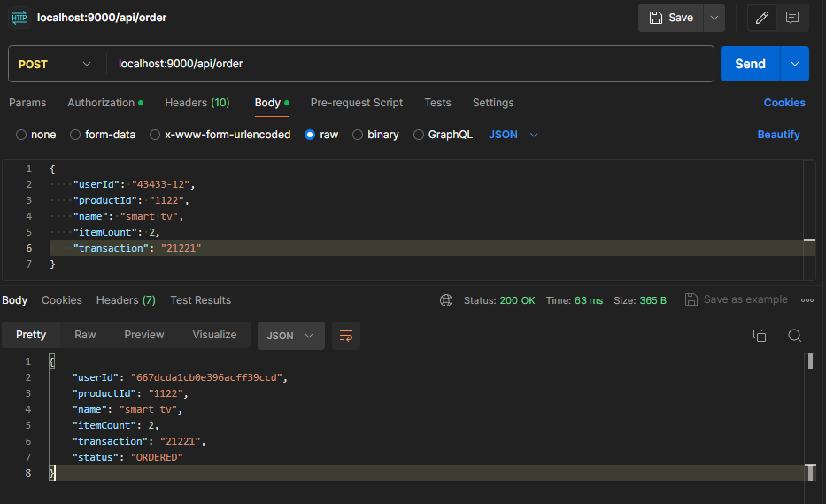
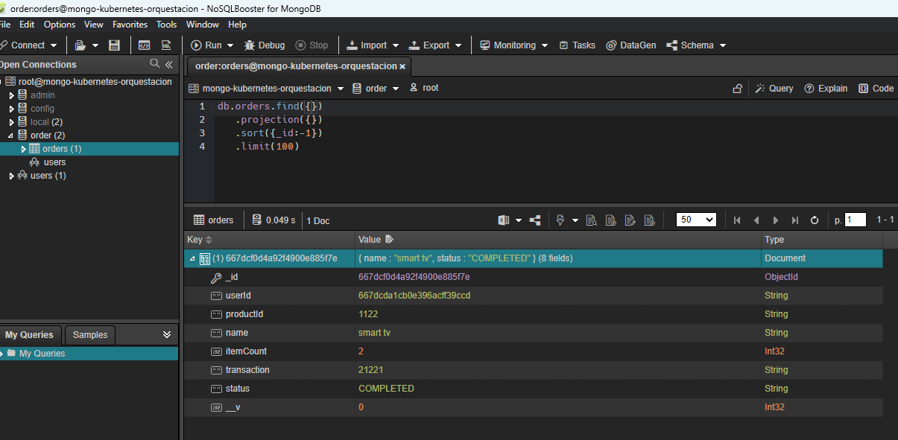

# Orders microservices infrastructure

## Content

* [Technical Introduction](#introduction)
* [Tech stack used for the project](#tech-stack-used-for-the-project)
* [How to set it up locally](#how-to-set-it-up-locally)
* [Example of usage](#example-of-usage)

## Technical Introduction

This project is all about a Orders microservices infrastructure that I had to create by my own where it contains 5 microservices and the API Gateway,each one of them is in charge to change the order status to the respective one either ORDERED-PAID-STORED-DELIVERED-COMPLETED-CANCELLED, it was made with the main technologies Typescript and NodeJS, using so many patterns and implementing hexagonal architecture as main alignment core in each one of them, all of them are uncoupled since it's used a message broker like RabbitMQ to handle all the communication with it using the saga pattern to handle all the sucessful and rejected transactions.

### Hexagonal architecture used for the skaffolding per each microservice

### Outline of the architectured implemented

## Tech stack used for the project

* NodeJS
* Typescript
* Hexagonal Architecture
* MongoDB
* RabbitMQ 
* Docker

## How to set it up locally

1. Make sure you have installed Docker and Docker compose.
2. Clone the repository
3. In the root of the project execute the command ``docker-compose up -d``
4. Now it's up and can requests API to use it

## Example of usage

1. Register your account in the process

2. Sign-in in the application

3. Create any order attaching the access token as Bearer token

4. Verify if the order is completed with any DB reader

